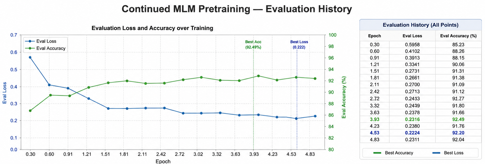
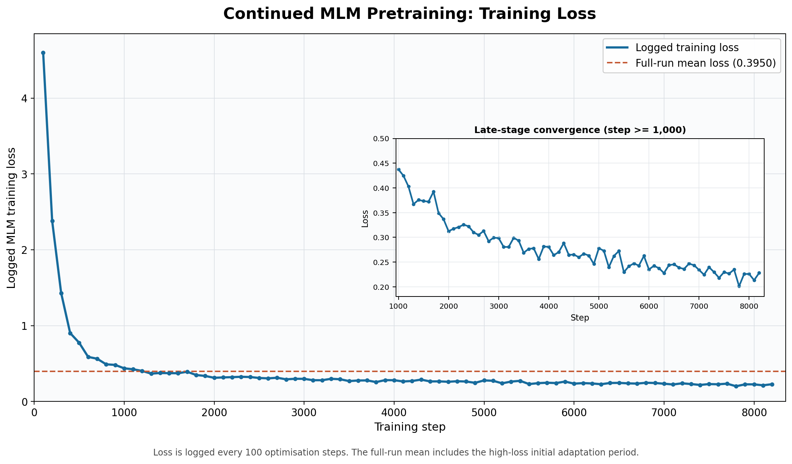
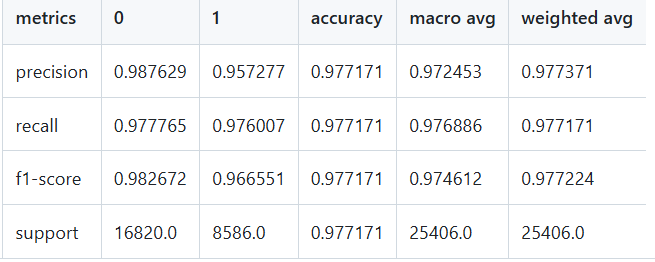

# Phase 1: Synthetic Dataset Reconstruction

## 1. Cohort Definition and Index Date

We reconstructed the synthetic cohort using the following logic:

### 1.1 Diabetes Cohort Defination and index date

Patients are assigned to the **diabetes cohort** if they have at least one **E10** or **E11** diagnosis (as Synthea does not generate specific T1D cohorts so broader DM definition here).

Note for **DM-positive** patients:

- The **index date** is defined as the first occurrence of an E10 or E11 code.
- Patients are excluded if they have any E08 or E09 code before their first E10/E11 diagnosis,since by index time they already carry an established diabetes diagnosis from another cause — including them risks both
misclassification and data leakage (their "pre-symptomatic" window contains active diabetes).
### 1.2 Control Cohort

Patients are labelled as controls if they have no **E08**, **E09**, **E10**, or **E11** codes across their full record.

For **controls**:

- The **index date** is defined as 12 months before the last observed clinical activity (including any diagnosis, prescription (RxNorm), lab/observation, or SNOMED finding).

The 12-month buffer is intentional. It prevents the lookback window from running up to the most recent activity, where index-period and pre-symptomatic signals may blur.

The purpose is to ensure that the 36-month lookback reflects real clinical follow-up rather than a gap or loss of observation in the record.


## 2. Lookback Window

For both diabetes and control cohorts, we extract a **36-month pre-index history window**.

Formally, an event is retained when:

```text
index_date - 36 months <= event_date < index_date
```

## 3. Age Handling

In the original Synthea data, the age token reflects the patient's age at the start of the record, typically within the range of 0-20 years.

We updated the age calculation to use **age at the index date**, which is more appropriate for cohort construction and evaluation.

The cohort was then restricted to patients aged between **5 and 50 years**, inclusive, at the index date.


## 4. Position ID Re-indexing

In the original Synthea data, event positions are measured from the start of a patient's entire medical history and can therefore become very large.

Since OSCAR only supports position IDs between 0 and 1824, events retained in the 36-month lookback window were re-indexed relative to the start of that window. Position 0 was reserved for demographic tokens, while medical events were assigned positions starting from 1.

This preserves the ordering and spacing of events within the lookback window while ensuring compatibility with OSCAR.

```text
max_position_embeddings = 1825
valid position IDs = 0-1824
```


# Phase 2 OSCAR readiness assessment #
## 5. OSCAR Vocabulary Compatibility Assessment

To assess whether the provided OSCAR model can be directly applied to the reconstructed Synthea cohort, we first evaluated vocabulary overlap between the Synthea corpus and the OSCAR vocabulary.

### 5.1 OOV Assessment

| Metric | Value |
| --- | ---: |
| Synthea vocabulary size | 1,479 |
| OSCAR vocabulary size | 76,681 |
| Overlapping tokens | **26** |
| Synthea covered by OSCAR | 1.76% |
| OSCAR covered by Synthea | 0.03% |
| Synthea tokens missing from OSCAR | 1,453 |

The initial overlap was unexpectedly low despite the fact that both datasets encode similar clinical concepts.

Further investigation revealed that the low overlap was primarily caused by differences in token representation rather than genuinely different medical concepts.

Several coding systems used different naming conventions across the two datasets:

#### Coding-system prefix normalisation

| Synthea | OSCAR |
|----------|----------|
| ICD-10-CM: | ICD10CM: |
| SNOMED-CT: | SNOMED: |
| RxNorm_drug: | RXNORM: |

#### Demographic token normalisation

| Original | Normalised |
|----------|----------|
| RACE:white | RACE:White |
| ETHNICITY:hispanic | ETHNICITY:Hispanic |

#### Age token harmonisation

Age tokens were standardised to match the representation expected by the OSCAR vocabulary.

### 5.2 Post-normalisation Assessment

| Metric | Value |
| --- | ---: |
| Shared tokens | 485 |
| Synthea coverage by OSCAR | 32.79% |


After token harmonisation, coverage increased to 32.79%, confirming that vocabulary adaptation was feasible.
Although coverage increased substantially after token normalisation, a significant proportion of Synthea-specific tokens remained outside the original OSCAR vocabulary.

### 5.3 Vocabulary Expansion Strategy

Despite the improvement, a substantial number of Synthea-specific tokens remained absent from OSCAR.

To address this, we adopted a vocabulary-expansion strategy designed to preserve all pretrained OSCAR knowledge while extending support for Synthea-specific concepts.
As a result, the vocabulary expanded from 76,681 tokens to 77,501 tokens, with 820 new tokens added.

The adaptation workflow was:
```text
Synthea parquet
        |
        v
Normalise sorted_event_tokens
        |
        v
Generate Synthea vocabulary from normalised corpus
        |
        v
Retain original OSCAR vocabulary order
        |
        v
Append only new tokens not present in OSCAR
        |
        v
resize_token_embeddings()
        |
        v
Continued MLM pretraining on Synthea
```

This approach preserves all existing OSCAR token IDs and pretrained embeddings while extending the vocabulary to support Synthea-specific concepts. Newly added tokens are initialised through embedding resizing and subsequently learned during continued masked-language-model (MLM) pretraining on the Synthea corpus.


## 6. Continued Pretraining

Once vocabulary compatibility was addressed, we performed continued masked-language-model pretraining.

### 6.1 Objective and Source-Code Changes

The provided pretrained OSCAR model weights were used as the starting point for continued masked-language-model (MLM) pretraining on the reconstructed Synthea cohort. The model was therefore adapted to Synthea rather than trained from scratch.

The main changes to `src/pretrain_bert.py` were:

- Load the provided OSCAR weights from `pretrained_model_dir` instead of initialising a new BERT model.
- Resize the token embedding matrix from 76,681 to 77,501 entries to support the expanded Synthea vocabulary while preserving all existing OSCAR embeddings.
- Use the compatible eager attention implementation so that OSCAR's pretrained relative-position distance embeddings are loaded and retained.

The continued-pretraining configuration was updated to use the reconstructed Synthea dataset, expanded vocabulary, and OSCAR checkpoint. `transformers==4.49.0` was used because it loaded all 12 OSCAR distance-embedding tensors correctly.

### 6.2 Pretrain Results




Validation loss decreased from 0.5958 at step 500 to its minimum of 0.2224 at step 7,500. Validation accuracy increased from 0.8523 to above 0.92, reaching its maximum of 0.9249 at step 6,500. The small increase in validation loss after step 7,500 supports selecting `checkpoint-7500` rather than the final training state.


The best checkpoint was selected using validation MLM loss and used for downstream fine-tuning.

Overall, these results indicate that OSCAR successfully adapted to the Synthea token distribution.
## 7. Fine-tuning result

Fine-tuning stopped after approximately 47 epochs. Training-set evaluation produced approximately 0.9772 accuracy and 0.9666 diabetes-class F1. These are optimisation diagnostics and are not independent test results.

Precision and recall remained above 95% for both cohorts, indicating that the adapted OSCAR model was able to learn highly discriminative patterns from the reconstructed synthetic dataset.


## 8. Independent Inference Evaluation


### 8.1 Test Cohorts and Outputs
Two independent test cohorts were constructed from the original synthetic inference dataset.


| Test cohort | Total | Controls | Diabetes cases | Positive prevalence |
| --- | ---: | ---: | ---: | ---: |
| Balanced 1:1 | 1,856 | 928 | 928 | 50.00% |
| Synthetic natural prevalence | 1,207 | 928 | 279 | 23.12% |

The natural-prevalence cohort was designed to reproduce the prevalence in the original synthetic training population; it is not an estimate of real-world clinical prevalence.

Each inference run produces patient-level probabilities and predictions in `predictions.csv`, together with an HTML evaluation report and confusion-matrix/classification metrics. Results from the two cohorts must be reported separately because prevalence directly affects precision, predictive values, accuracy, and the confusion matrix.

### 8.2 Independent Test Results

| Metric | Natural prevalence | Balanced (1:1) |
| --- | ---: | ---: |
| Precision | 0.90 | 0.97 |
| Recall | 0.97 | 0.95 |
| F1 score | 0.93 | 0.96 |
| ROC-AUC | 0.97 | 0.96 |
| PR-AUC | 0.94 | 0.97 |
| Balanced accuracy | 0.97 | 0.96 |

detailed model report can be found in [model_report(balanced).html](aiml/outputs/inference/2026-06-14%2019-38-35%201to1/model_report.html) and [model_report(natural prevalence).html](aiml/outputs/inference/2026-06-14%2019-38-54%20natural%20prevalence/model_report.html)

The fine-tuned OSCAR model demonstrated strong discriminative performance under both evaluation settings.

As expected, precision was lower in the natural-prevalence cohort because positive cases were less common, increasing the
impact of false-positive predictions. Despite this, recall remained high (0.97), indicating that the majority of diabetes cases were correctly identified.

These findings suggest that the fine-tuning pipeline successfully learned discriminative patterns from the reconstructed synthetic cohort.

# Conclusions

Key outcomes of phase 2 include:

1. Successful reconstruction of a synthetic diabetes prediction cohort from Synthea.
2. Development of a reproducible OSCAR adaptation pipeline, including token harmonisation, vocabulary expansion, and continued MLM pretraining.
3. Successful adaptation of OSCAR to the reconstructed corpus, with validation MLM accuracy exceeding 92%.
4. Strong downstream diabetes-classification performance under both balanced and prevalence-based evaluation settings.
5. Readiness to proceed to the planned OSCAR–Qwen comparative evaluation.